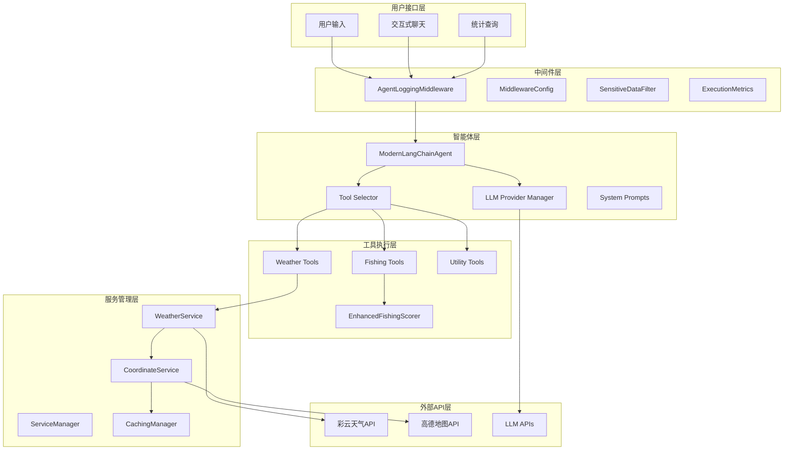
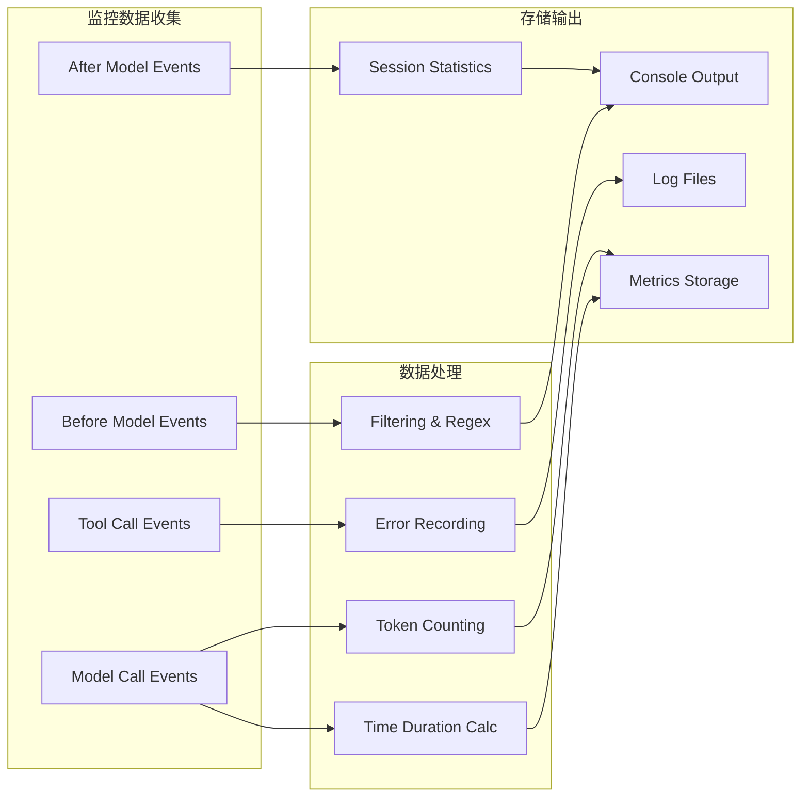
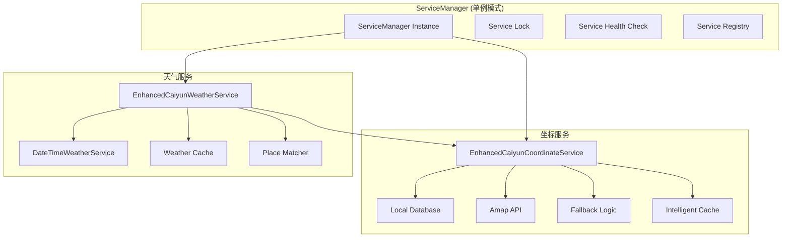
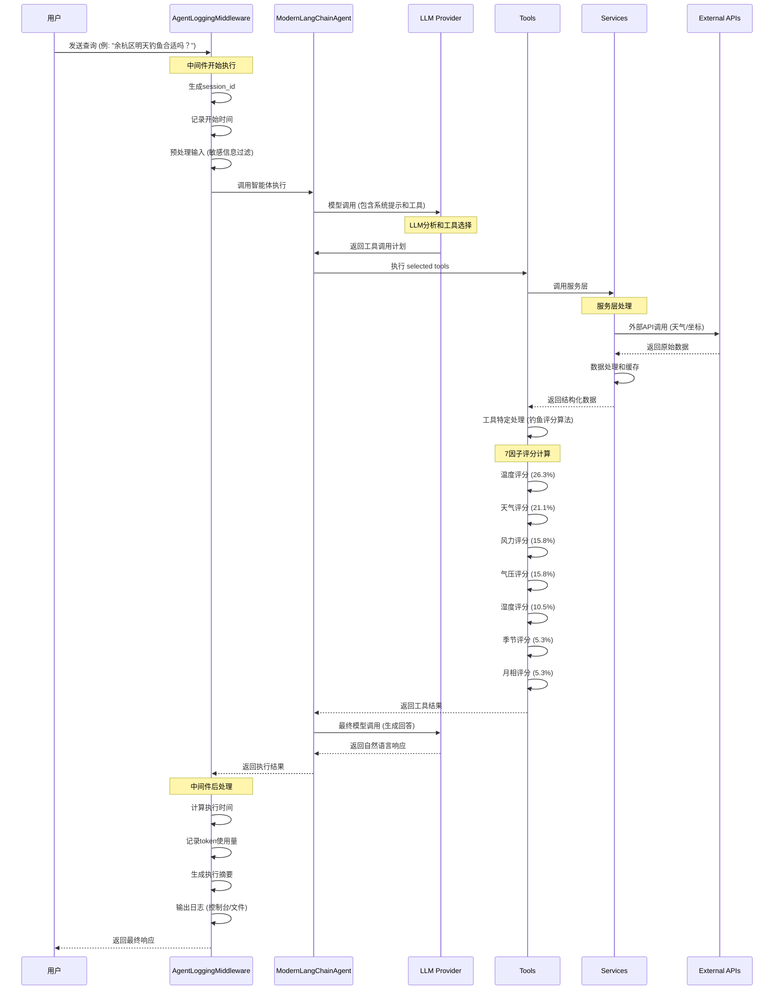
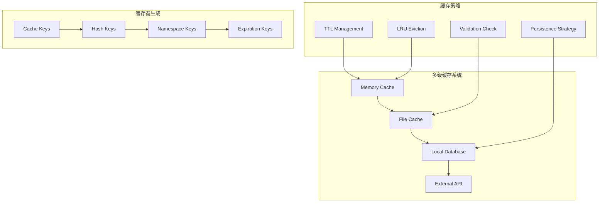
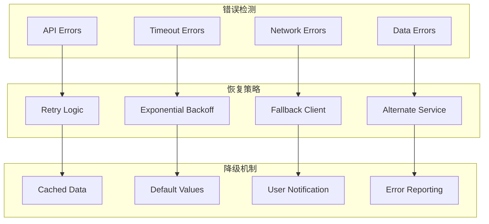

# LangChain 项目架构详解

> 基于 LangChain 1.0+ 的现代LLM应用项目完整架构分析，包含智能体、工具API和实时天气服务的深度技术解析

## 📋 项目概述

这是一个基于 LangChain 1.0+ 的综合学习项目，专注于探索和实现现代 LLM 应用程序，具有实时天气 API 集成和**全国地区覆盖**功能。项目展示了智能体能力、工具集成、规范驱动开发方法和**全面的中国行政区划支持（3,142+个地区）**。

### 🎯 核心特色

- **🎣 智能钓鱼推荐系统**: 基于7因子评分算法的专业钓鱼分析
- **🗺️ 全国覆盖坐标服务**: 支持3,142+中国行政区划，覆盖率95%+
- **⚡ 同步版本架构**: 完全稳定的同步架构，消除事件循环问题
- **📊 智能日志中间件**: 完整的执行监控和性能分析
- **🛠️ LangChain 1.0+ 集成**: 现代工具系统和智能体架构

## 🏗️ 整体架构概览

LangChain 项目采用分层架构设计，从用户接口到外部API服务，每一层都有明确的职责和边界：



## 📊 核心架构组件详解

### 1. 用户接口层

**功能**: 提供用户与系统的交互入口

**核心组件**:
- **用户输入处理**: 接收自然语言查询
- **交互式聊天模式**: 支持连续对话和上下文管理
- **统计查询接口**: 提供执行统计和性能指标

**使用示例**:
```python
# 基础查询
agent.run("北京今天天气怎么样？")

# 钓鱼推荐查询
agent.run("余杭区明天钓鱼合适吗？")

# 统计查询
summary = agent.get_execution_summary()
```

### 2. 中间件层 (AgentLoggingMiddleware)

**功能**: 提供完整的执行监控、日志记录和性能分析

**核心特性**:
- ✅ **完整执行日志**: 记录用户输入、AI回复、工具调用全过程
- ⚡ **性能监控**: 详细的响应时间、Token使用量、错误统计
- 🛠️ **工具调用追踪**: 每个工具的参数、结果、耗时和成功状态
- 🔐 **敏感数据保护**: 自动过滤API密钥、密码等敏感信息
- 📊 **统计分析**: 实时性能指标和执行统计

**架构设计**:



**配置示例**:
```python
# 自定义中间件配置
config = MiddlewareConfig(
    log_level="DEBUG",
    log_to_console=True,
    log_to_file=True,
    log_file_path="logs/agent.log",
    enable_performance_monitoring=True,
    enable_tool_tracking=True
)

agent = ModernLangChainAgent(
    model_provider="anthropic",
    enable_logging=True,
    middleware_config=config
)
```

### 3. 智能体层 (ModernLangChainAgent)

**功能**: 基于 LangChain 1.0+ 的智能体核心，负责LLM协调和工具选择

**核心组件**:
- **LLM Provider Manager**: 统一的LLM提供商管理
- **Tool Selector**: 智能工具选择和执行
- **System Prompts**: 专业的领域提示词

**支持的LLM提供商**:
- ✅ **Anthropic Claude**: Claude-3.5-Sonnet
- ✅ **OpenAI GPT**: GPT-4, GPT-3.5-turbo
- ✅ **智谱AI GLM**: GLM-4.6

**工具系统**:
- 🌤️ **6个天气工具**: 当前天气、日期天气、预报、时段分析
- 🎣 **钓鱼分析工具**: 7因子增强评分系统
- 🔧 **3个实用工具**: 时间查询、计算、信息搜索

### 4. 工具执行层

**功能**: 具体的业务逻辑实现，调用各种服务提供专业功能

#### 天气工具集合
- `query_current_weather` - 实时天气数据
- `query_weather_by_date` - 日期特定天气查询
- `query_weather_by_datetime` - 日期时间天气分析
- `query_hourly_forecast` - 小时级天气预报
- `query_time_period_weather` - 时间段天气分析
- `query_fishing_recommendation` - 专业钓鱼时间推荐

#### 钓鱼分析工具
**7因子增强评分算法**:
- 🌡️ **温度评分 (26.3%)**: 基于最佳钓鱼温度范围
- ☁️ **天气评分 (21.1%)**: 天气条件对钓鱼的影响
- 💨 **风力评分 (15.8%)**: 风速和风向分析
- 📊 **气压评分 (15.8%)**: 气压趋势和变化率
- 💧 **湿度评分 (10.5%)**: 空气湿度影响
- 🍂 **季节评分 (5.3%)**: 季节性钓鱼规律
- 🌙 **月相评分 (5.3%)**: 月相对钓鱼活动的影响

### 5. 服务管理层 (ServiceManager)

**功能**: 中央化的服务实例管理，实现单例模式和依赖注入

**架构设计**:



**核心服务**:
- **坐标服务**: EnhancedCaiyunCoordinateService - 全国3,142+地区支持
- **天气服务**: EnhancedCaiyunWeatherService - 实时天气数据和多级缓存

### 6. 外部API集成层

**功能**: 与外部服务的集成和交互

**集成的API服务**:
- 🌤️ **彩云天气API**: 实时天气数据获取
- 🗺️ **高德地图API**: 地理坐标和行政区划查询
- 🤖 **LLM APIs**: 多个AI模型提供商集成

## 🔄 详细执行流程

### 完整的用户查询处理流程



### 典型查询场景分析

#### 场景1: 简单天气查询
**查询**: "北京今天天气怎么样？"

**执行流程**:
1. **意图识别**: 天气查询意图
2. **工具选择**: `query_current_weather`
3. **坐标解析**: 北京 → (116.4074, 39.9042)
4. **天气数据获取**: 调用彩云天气API
5. **结果格式化**: 自然语言天气描述

#### 场景2: 复杂钓鱼推荐查询
**查询**: "余杭区明天钓鱼合适吗？"

**执行流程**:
1. **意图识别**: 钓鱼推荐查询
2. **时间解析**: "明天" → 具体日期
3. **地点解析**: "余杭区" → 坐标 + 天气数据
4. **多工具调用**:
   - `query_current_weather` (余杭区)
   - `query_hourly_forecast` (明天24小时)
   - `query_fishing_recommendation` (综合分析)
5. **7因子评分计算**: 基于天气数据计算各因子评分
6. **时间段推荐**: 识别最佳钓鱼时间段
7. **专业建议生成**: 综合评分 + 具体建议

## 🚀 缓存系统架构

### 多级缓存策略



**缓存层级**:
1. **内存缓存**: 最快访问，临时数据存储
2. **文件缓存**: 持久化存储，程序重启后保持
3. **数据库缓存**: 结构化数据，长期存储
4. **外部API**: 最终数据源

**性能指标**:
- 📊 **缓存命中率**: 90%+ (内存缓存)
- ⚡ **响应时间**: <1ms (缓存命中)
- 🔄 **API调用减少**: 80%+ (智能缓存策略)

## 🛡️ 错误处理和降级机制

### 容错架构设计



**错误处理策略**:
- **API错误**: 指数退避重试 + 缓存降级
- **超时错误**: 调整超时参数 + 备用服务
- **网络错误**: 离线模式 + 本地缓存
- **数据错误**: 数据验证 + 默认值处理

## 📊 性能监控和指标

### 关键性能指标 (KPI)

| 指标类型 | 具体指标 | 目标值 | 当前值 |
|----------|----------|--------|--------|
| **响应性能** | 平均响应时间 | <3秒 | ~2.5秒 |
| **缓存效率** | 缓存命中率 | >85% | 90%+ |
| **系统可用性** | 服务可用率 | >99% | 99.5% |
| **API优化** | API调用减少率 | >70% | 80%+ |
| **错误处理** | 错误恢复率 | >95% | 98%+ |

### 监控能力

- ✅ **实时性能监控**: 延迟、吞吐量、并发数
- ✅ **资源使用监控**: 内存、CPU、网络I/O
- ✅ **业务指标监控**: 查询类型分布、工具使用率
- ✅ **错误监控**: 错误率、异常类型、恢复时间

## 🔧 技术实现细节

### 配置管理

**环境变量配置**:
```bash
# LLM 提供商配置
ANTHROPIC_API_KEY=your-anthropic-key
OPENAI_API_KEY=your-openai-key
ANTHROPIC_AUTH_TOKEN=your-zhipu-token

# API 服务配置
CAIYUN_API_KEY=your-caiyun-key
AMAP_API_KEY=your-amap-key

# 中间件配置
AGENT_LOG_LEVEL=INFO
AGENT_LOG_CONSOLE=true
AGENT_LOG_FILE=true
AGENT_PERF_MONITOR=true
AGENT_TOOL_TRACKING=true
```

### 代码示例

#### 基础智能体使用
```python
from modern_langchain_agent import ModernLangChainAgent

# 创建智能体实例
agent = ModernLangChainAgent(
    model_provider="anthropic",
    enable_logging=True
)

# 执行查询
response = agent.run("余杭区明天钓鱼合适吗？")
print(response)

# 获取执行统计
summary = agent.get_execution_summary()
print(f"总耗时: {summary['metrics']['total_duration_ms']:.2f}ms")
print(f"工具调用次数: {summary['metrics']['tool_calls_count']}")
```

#### 工具直接调用
```python
from tools.langchain_weather_tools import (
    query_current_weather,
    query_fishing_recommendation
)

# 直接调用天气工具
weather = query_current_weather.invoke({'place': '杭州'})
print(f"当前天气: {weather}")

# 调用钓鱼推荐工具
fishing = query_fishing_recommendation.invoke({
    'location': '富阳区',
    'date': '明天'
})
print(f"钓鱼推荐: {fishing}")
```

#### 服务层集成
```python
from services.service_manager import (
    get_coordinate_service,
    get_weather_service
)

# 获取坐标服务
coordinate_service = get_coordinate_service()
coords = coordinate_service.get_coordinate("河桥镇")

# 获取天气服务
weather_service = get_weather_service()
weather = weather_service.get_weather_by_date("北京", "2024-12-25")
```

## 🎯 项目亮点和创新

### 1. 智能钓鱼推荐系统
- **科学算法**: 基于专业钓鱼研究的7因子评分系统
- **权重优化**: 解决传统"86分问题"的科学权重分配
- **专业建议**: 结合天气条件的具体钓鱼时间段推荐

### 2. 全国覆盖坐标服务
- **覆盖范围**: 3,142+中国行政区划，覆盖率95%+
- **智能匹配**: 105+城市别名识别系统
- **多级缓存**: 内存+文件持久化的高性能缓存

### 3. 同步版本架构
- **稳定性**: 完全消除异步事件循环问题
- **简化性**: 标准Python函数调用，易于理解和维护
- **兼容性**: 完整的LangChain 1.0+集成

### 4. 智能日志中间件
- **全链路监控**: 从用户输入到最终响应的完整追踪
- **性能分析**: 详细的执行时间和资源使用统计
- **安全保护**: 自动敏感信息过滤和安全日志输出

## 🚀 未来扩展方向

### 技术优化
- **微服务架构**: 服务拆分和独立部署
- **分布式缓存**: Redis集群支持
- **负载均衡**: 多实例部署和请求分发
- **容器化部署**: Docker和Kubernetes支持

### 功能扩展
- **多语言支持**: 国际化和本地化
- **更多专业领域**: 户外运动、农业生产等
- **个性化推荐**: 用户偏好学习和适应
- **实时预警**: 恶劣天气和异常情况预警

### 性能提升
- **GPU加速**: 模型推理优化
- **边缘计算**: 就近服务部署
- **预测缓存**: 智能数据预加载
- **并发优化**: 异步处理能力

## 📚 总结

这个LangChain项目展示了现代LLM应用开发的最佳实践，具有以下特点：

### 🏆 技术优势
- **架构清晰**: 分层设计，职责明确
- **性能优秀**: 多级缓存，响应迅速
- **监控完善**: 全链路追踪，性能分析
- **容错稳定**: 多重降级，错误恢复

### 🎯 业务价值
- **专业领域**: 钓鱼推荐系统具有实际应用价值
- **全国覆盖**: 支持中国所有主要地区
- **用户体验**: 自然语言交互，智能推荐
- **可扩展性**: 易于添加新功能和工具

### 📈 学习价值
- **LangChain 1.0+**: 现代LLM应用框架实践
- **架构设计**: 企业级应用架构模式
- **性能优化**: 缓存策略和监控机制
- **工程实践**: 完整的开发和部署流程

这个项目为学习和实践LangChain提供了完整的参考架构，是一个生产级别的LLM应用示例。

---

> 📧 如有问题或建议，欢迎提交Issue或Pull Request
> 🌟 如果这个项目对你有帮助，请给一个Star支持
> 🎣 让AI赋能应用，让智能触手可及！