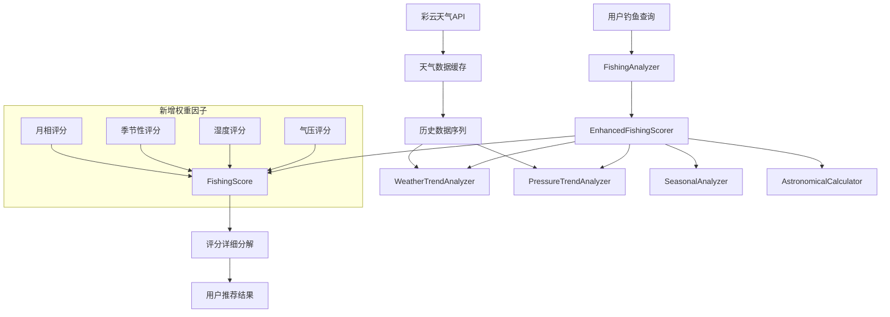
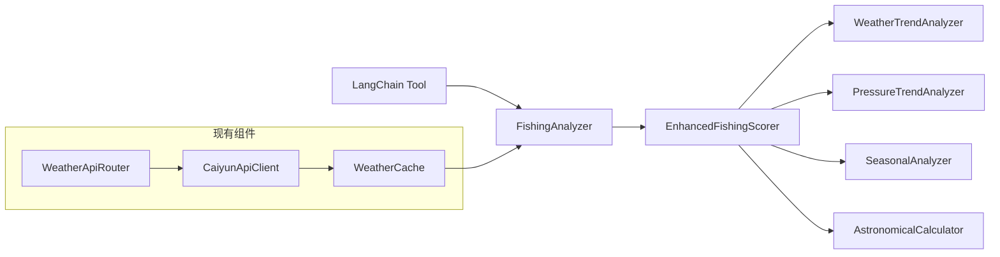
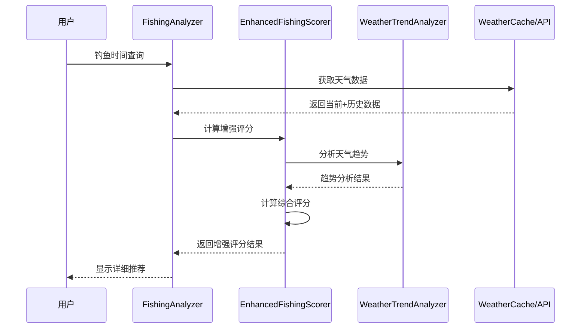
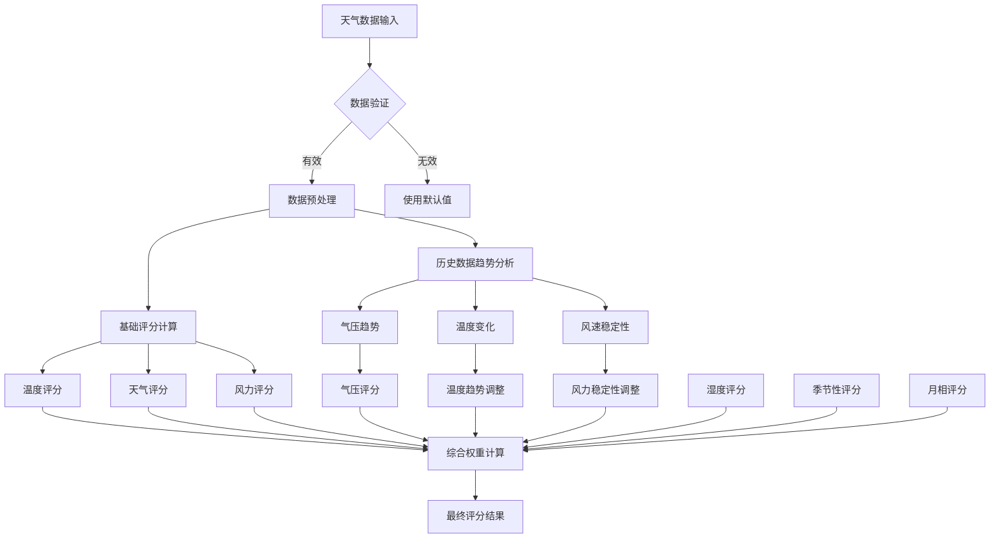

# 钓鱼权重优化设计方案

**设计文档版本**: 1.0
**创建时间**: 2025-11-05
**状态**: 📋 待实施
**对应提案**: optimize-fishing-recommendation-weights

## 设计概览

### 设计目标

1. **解决评分相同问题**: 通过引入多维度专业权重因子，提高评分区分度
2. **提升推荐准确性**: 基于钓鱼科学研究和气象学原理优化评分算法
3. **保持系统稳定**: 向后兼容现有接口，渐进式部署
4. **零额外成本**: 基于现有API数据，无需额外数据源

### 设计原则

1. **专业导向**: 基于钓鱼科学研究、气象学原理和实际经验
2. **数据驱动**: 充分利用现有彩云天气API提供的完整数据
3. **精细评分**: 从3个权重因子扩展到7个，提升评分精度
4. **可扩展性**: 支持未来新增权重因子的动态扩展

## 系统架构设计

### 整体架构图



### 模块关系图



## 数据流设计

### 数据输入流程



### 数据处理流程



## 算法设计

### 权重分配策略

#### 当前权重 vs 优化权重对比

| 权重因子 | 当前权重 | 优化权重 | 变化 | 科学依据 |
|----------|----------|----------|------|----------|
| 温度 | 40% | 25% | ⬇️ -15% | 基础重要，但不是唯一因素 |
| 天气 | 35% | 20% | ⬇️ -15% | 重要，但权重过高 |
| 风力 | 25% | 15% | ⬇️ -10% | 重要，需要稳定性分析 |
| 气压 | 0% | 15% | ⬆️ +15% | 新增：鱼类活动关键因子 |
| 湿度 | 0% | 10% | ⬆️ +10% | 新增：反映气压系统 |
| 季节性 | 0% | 5% | ⬆️ +5% | 新增：鱼类生物学规律 |
| 月相 | 0% | 5% | ⬆️ +5% | 新增：天文影响因子 |

#### 权重优化原理

1. **温度权重降低**: 从40%降至25%，避免过度依赖温度
2. **专业因子引入**: 气压、湿度基于气象学研究，季节、月相基于钓鱼经验
3. **平衡发展**: 各权重因子分布更合理，避免单因子过度影响
4. **科学依据**: 每个权重都有明确的科学或经验依据

### 评分算法设计

#### 1. 气压评分算法

```python
def calculate_pressure_comprehensive_score(self, pressure: float, trend: str) -> float:
    """
    气压综合评分算法

    科学依据：
    - 最佳范围：1005-1029 hPa (鱼类活跃期)
    - 下降趋势：风暴前鱼类进食增加 (钓鱼黄金期)
    - 上升趋势：天气稳定，鱼类活动减少
    """

    # 基础评分 (0-100分)
    base_score = self.calculate_base_pressure_score(pressure)

    # 趋势调整 (0.8-1.2倍)
    trend_multipliers = {
        'falling_fast': 1.20,    # 快速下降 - 最佳时机
        'falling_slow': 1.10,    # 缓慢下降 - 良好时机
        'stable': 1.00,           # 稳定 - 正常时机
        'rising_slow': 0.90,      # 缓慢上升 - 较差时机
        'rising_fast': 0.80       # 快速上升 - 最差时机
    }

    multiplier = trend_multipliers.get(trend, 1.00)
    return min(115, base_score * multiplier)  # 最高115分，奖励最佳时机
```

#### 2. 湿度评分算法

```python
def calculate_humidity_score(self, humidity: float, pressure_trend: str) -> float:
    """
    湿度评分算法

    科学依据：
    - 湿度反映气压系统变化
    - 高湿度(>80%)通常伴随低气压，鱼类活跃
    - 极端湿度(<40%或>95%)通常不利于钓鱼
    """

    # 基础湿度评分
    if 60 <= humidity <= 80:
        base_score = 100.0          # 理想湿度
    elif 80 < humidity <= 90:
        base_score = 95.0           # 高湿度（低气压信号）
    elif 90 < humidity <= 95:
        base_score = 90.0           # 很高湿度
    elif 40 <= humidity < 60:
        base_score = 80.0           # 中等湿度
    else:
        base_score = 65.0           # 极端湿度

    # 气压趋势调整
    if pressure_trend == 'falling' and humidity > 75:
        base_score += 5  # 下降气压+高湿度双重奖励

    return min(100, base_score)
```

#### 3. 季节性评分算法

```python
def calculate_seasonal_score(self, date: datetime, time_desc: str) -> float:
    """
    季节性评分算法

    科学依据：
    - 春季：鱼类繁殖期，活跃度高，早晚最佳
    - 夏季：高温期，避开中午，清晨傍晚最佳
    - 秋季：觅食期，为过冬储备能量，全天较好
    - 冬季：低温期，代谢缓慢，中午相对最佳
    """

    month = date.month
    hour = date.hour

    # 季节识别
    if 3 <= month <= 5:      # 春季
        return self._spring_season_score(hour)
    elif 6 <= month <= 8:    # 夏季
        return self._summer_season_score(hour)
    elif 9 <= month <= 11:   # 秋季
        return self._autumn_season_score(hour)
    else:                    # 冬季
        return self._winter_season_score(hour)

def _spring_season_score(self, hour: int) -> float:
    """春季评分：繁殖期，早晚活跃"""
    if 6 <= hour <= 9 or 17 <= hour <= 19:
        return 100.0      # 早晚最佳
    elif 10 <= hour <= 16:
        return 85.0       # 中午稍差
    else:
        return 70.0       # 其他时间

def _summer_season_score(self, hour: int) -> float:
    """夏季评分：避高温，清晨傍晚"""
    if 5 <= hour <= 8 or 18 <= hour <= 20:
        return 100.0      # 清晨傍晚最佳
    elif 11 <= hour <= 15:
        return 60.0       # 中午最差
    else:
        return 80.0       # 其他时间尚可

def _autumn_season_score(self, hour: int) -> float:
    """秋季评分：觅食期，全天较好"""
    if 7 <= hour <= 10 or 16 <= hour <= 19:
        return 100.0      # 上午下午最佳
    else:
        return 85.0       # 其他时间也很好

def _winter_season_score(self, hour: int) -> float:
    """冬季评分：低温期，中午相对较好"""
    if 11 <= hour <= 14:
        return 90.0       # 中午最佳
    elif 9 <= hour <= 16:
        return 75.0       # 白天尚可
    else:
        return 50.0       # 早晚很差
```

#### 4. 月相评分算法

```python
def calculate_lunar_score(self, date: datetime, time_desc: str) -> float:
    """
    月相评分算法

    科学依据：
    - 新月：温和天气，气压较低，鱼类活跃
    - 满月：引力影响，夜间鱼类活跃，白天相对安静
    - 上弦/下弦：中等引力影响，鱼类活动中等
    """

    moon_phase = self.calculate_moon_phase(date)
    is_night = time_desc in ['dawn', 'dusk', 'night']

    # 月相基础评分
    phase_scores = {
        'new_moon': 85,           # 新月：温和天气
        'waxing_crescent': 80,    # 娥眉月：渐佳
        'first_quarter': 75,      # 上弦月：中等
        'waxing_gibbous': 82,     # 盈凸月：较好
        'full_moon': 65,          # 满月：白天一般
        'waning_gibbous': 78,     # 亏凸月：中等
        'last_quarter': 75,       # 下弦月：中等
        'waning_crescent': 80     # 残月：渐佳
    }

    base_score = phase_scores.get(moon_phase, 75)

    # 满月夜间调整
    if moon_phase == 'full_moon' and is_night:
        base_score = 90  # 满月夜间加分

    # 新月调整（通常伴随好天气）
    if moon_phase == 'new_moon':
        base_score = max(base_score, 85)

    return base_score
```

## 性能设计

### 计算复杂度分析

```python
# 时间复杂度分析
def calculate_comprehensive_score(hourly_data, historical_data, date):
    """
    时间复杂度：O(n) where n = historical_data.length
    空间复杂度：O(1) - 固定内存使用

    主要计算成本：
    - 趋势分析：O(n) - 遍历历史数据
    - 各因子评分：O(1) - 常数时间计算
    - 权重综合：O(1) - 固定数量权重计算
    """

    # 性能优化策略
    # 1. 历史数据缓存：避免重复计算
    # 2. 趋势增量更新：只计算新增数据点
    # 3. 并行计算：各因子可并行计算
    # 4. 结果缓存：相同参数结果缓存
```

### 内存使用优化

```python
# 内存使用策略
class MemoryOptimizedScorer:
    def __init__(self):
        # 使用LRU缓存历史趋势结果
        self.trend_cache = LRUCache(maxsize=100)

        # 使用固定大小的滑动窗口
        self.data_window = SlidingWindow(size=24)  # 24小时数据

        # 使用轻量级数据结构
        self.score_components = np.array([0.0] * 7)  # 预分配数组

    def get_trend_analysis(self, current_data):
        """优化的趋势分析"""
        cache_key = self._generate_cache_key(current_data)

        # 缓存命中
        if cache_key in self.trend_cache:
            return self.trend_cache[cache_key]

        # 缓存未命中，计算并缓存
        result = self._calculate_trend(current_data)
        self.trend_cache[cache_key] = result
        return result
```

### 缓存策略设计

```python
# 多层缓存架构
class ScoringCacheManager:
    """
    缓存层级：
    1. L1缓存：内存LRU缓存 (最近计算结果)
    2. L2缓存：本地文件缓存 (持久化缓存)
    3. L3缓存：天气服务缓存 (避免重复API调用)
    """

    def __init__(self):
        # L1: 内存缓存
        self.memory_cache = LRUCache(maxsize=1000)

        # L2: 文件缓存
        self.file_cache = FileCache('scoring_cache.json')

        # L3: 天气数据缓存
        self.weather_cache = WeatherCache()

    def get_cached_score(self, cache_key: str):
        """多层缓存获取"""
        # 尝试L1缓存
        if cache_key in self.memory_cache:
            return self.memory_cache[cache_key]

        # 尝试L2缓存
        cached_result = self.file_cache.get(cache_key)
        if cached_result:
            self.memory_cache[cache_key] = cached_result
            return cached_result

        # 缓存未命中，返回None
        return None
```

## 数据库设计

### 评分结果存储

```sql
-- 评分结果表设计
CREATE TABLE fishing_scores (
    id INTEGER PRIMARY KEY AUTOINCREMENT,
    location_name VARCHAR(100) NOT NULL,
    date DATE NOT NULL,
    hour INTEGER NOT NULL,

    -- 评分结果
    overall_score DECIMAL(5,2) NOT NULL,
    temperature_score DECIMAL(5,2),
    weather_score DECIMAL(5,2),
    wind_score DECIMAL(5,2),
    pressure_score DECIMAL(5,2),
    humidity_score DECIMAL(5,2),
    seasonal_score DECIMAL(5,2),
    lunar_score DECIMAL(5,2),

    -- 评分权重
    weight_temperature DECIMAL(3,2),
    weight_weather DECIMAL(3,2),
    weight_wind DECIMAL(3,2),
    weight_pressure DECIMAL(3,2),
    weight_humidity DECIMAL(3,2),
    weight_seasonal DECIMAL(3,2),
    weight_lunar DECIMAL(3,2),

    -- 原始数据
    temperature DECIMAL(5,2),
    weather_condition VARCHAR(50),
    wind_speed DECIMAL(5,2),
    wind_direction INTEGER,
    humidity DECIMAL(5,2),
    pressure DECIMAL(7,2),

    -- 分析结果
    pressure_trend VARCHAR(20),
    temperature_change DECIMAL(5,2),
    wind_stability VARCHAR(20),
    lunar_phase VARCHAR(20),

    -- 元数据
    created_at TIMESTAMP DEFAULT CURRENT_TIMESTAMP,
    updated_at TIMESTAMP DEFAULT CURRENT_TIMESTAMP,

    -- 索引
    INDEX idx_location_date (location_name, date),
    INDEX idx_date_hour (date, hour),
    INDEX idx_overall_score (overall_score)
);
```

### 历史趋势数据

```sql
-- 历史趋势数据表
CREATE TABLE weather_trends (
    id INTEGER PRIMARY KEY AUTOINCREMENT,
    location_name VARCHAR(100) NOT NULL,
    timestamp TIMESTAMP NOT NULL,

    -- 气象数据
    temperature DECIMAL(5,2),
    humidity DECIMAL(5,2),
    pressure DECIMAL(7,2),
    wind_speed DECIMAL(5,2),

    -- 计算的趋势指标
    pressure_trend_3h DECIMAL(5,2),    -- 3小时气压变化
    pressure_trend_6h DECIMAL(5,2),    -- 6小时气压变化
    temperature_trend_3h DECIMAL(5,2),  -- 3小时温度变化
    wind_stability_3h DECIMAL(5,2),    -- 3小时风速稳定性

    created_at TIMESTAMP DEFAULT CURRENT_TIMESTAMP,

    INDEX idx_location_timestamp (location_name, timestamp),
    INDEX idx_timestamp (timestamp)
);
```

## 接口设计

### 核心接口

```python
# 主要评分接口
class IFishingScorer(ABC):
    """钓鱼评分器接口"""

    @abstractmethod
    def calculate_score(
        self,
        hourly_data: Dict[str, Any],
        historical_data: List[Dict[str, Any]],
        date: datetime
    ) -> FishingScore:
        """计算钓鱼评分"""
        pass

    @abstractmethod
    def get_score_breakdown(self, score: FishingScore) -> Dict[str, Any]:
        """获取评分分解"""
        pass

# 趋势分析接口
class ITrendAnalyzer(ABC):
    """趋势分析器接口"""

    @abstractmethod
    def analyze_trend(self, data_series: List[float]) -> Dict[str, Any]:
        """分析数据趋势"""
        pass

# 天文计算接口
class IAstronomicalCalculator(ABC):
    """天文计算器接口"""

    @abstractmethod
    def calculate_lunar_phase(self, date: datetime) -> str:
        """计算月相"""
        pass
```

### API接口

```python
# REST API设计
@router.post("/api/v2/fishing/enhanced-score")
async def calculate_enhanced_fishing_score(
    location: str,
    date: str,
    use_enhanced: bool = True
):
    """
    计算增强钓鱼评分API

    Args:
        location: 地点名称
        date: 查询日期 (YYYY-MM-DD)
        use_enhanced: 是否使用增强评分算法

    Returns:
        评分结果和详细分解
    """
    pass

@router.get("/api/v2/fishing/score-breakdown")
async def get_score_breakdown(
    location: str,
    date: str,
    hour: int
):
    """
    获取评分详细分解API

    Args:
        location: 地点名称
        date: 查询日期
        hour: 小时数

    Returns:
        各权重因子的详细评分
    """
    pass
```

## 测试设计

### 测试策略

```python
# 测试金字塔
class FishingScorerTestSuite:
    """
    测试层次：
    1. 单元测试 (70%) - 各算法函数测试
    2. 集成测试 (20%) - 组件集成测试
    3. 端到端测试 (10%) - 完整流程测试
    """

    def test_pressure_scoring_edge_cases(self):
        """气压评分边界条件测试"""
        test_cases = [
            (950, 'extreme_low'),    # 极低气压
            (1050, 'extreme_high'),   # 极高气压
            (1017, 'optimal'),        # 最佳气压
            (1000, 'low'),           # 低气压
            (1035, 'high')           # 高气压
        ]

        for pressure, scenario in test_cases:
            score = self.scorer.calculate_pressure_score(pressure)
            assert 0 <= score <= 115
            self.assert_score_reasonable(score, scenario)

    def test_seasonal_patterns(self):
        """季节性模式测试"""
        # 构造一年中典型日期的测试数据
        test_dates = [
            (datetime(2024, 4, 15, 7, 0), 'spring_morning'),    # 春季早晨
            (datetime(2024, 7, 15, 14, 0), 'summer_noon'),     # 夏季中午
            (datetime(2024, 10, 15, 10, 0), 'autumn_morning'),  # 秋季早晨
            (datetime(2024, 1, 15, 12, 0), 'winter_noon')      # 冬季中午
        ]

        for date, expected_pattern in test_dates:
            score = self.scorer.calculate_seasonal_score(date)
            assert score >= 50  # 最低得分保证
            self.assert_seasonal_pattern_correct(score, expected_pattern)
```

### 性能测试

```python
# 性能测试设计
class PerformanceTestSuite:
    """性能测试套件"""

    def test_scoring_performance(self):
        """评分性能测试"""
        import time
        import statistics

        # 构造大量测试数据
        test_data = self.generate_test_dataset(1000)

        # 执行性能测试
        execution_times = []
        for data in test_data:
            start_time = time.time()
            score = self.scorer.calculate_comprehensive_score(*data)
            execution_time = time.time() - start_time
            execution_times.append(execution_time)

        # 性能指标验证
        avg_time = statistics.mean(execution_times)
        max_time = max(execution_times)
        p95_time = statistics.quantiles(execution_times, n=20)[18]  # 95th percentile

        # 性能断言
        assert avg_time < 0.01, f"平均时间过长: {avg_time:.4f}s"
        assert max_time < 0.05, f"最大时间过长: {max_time:.4f}s"
        assert p95_time < 0.02, f"95%分位时间过长: {p95_time:.4f}s"

    def test_memory_usage(self):
        """内存使用测试"""
        import psutil
        import os

        process = psutil.Process(os.getpid())
        initial_memory = process.memory_info().rss / 1024 / 1024  # MB

        # 执行大量评分计算
        for _ in range(10000):
            test_data = self.generate_random_test_data()
            self.scorer.calculate_comprehensive_score(*test_data)

        final_memory = process.memory_info().rss / 1024 / 1024  # MB
        memory_increase = final_memory - initial_memory

        # 内存使用断言
        assert memory_increase < 50, f"内存增长过多: {memory_increase:.2f}MB"
```

## 部署设计

### 渐进式部署策略

```python
# 功能开关设计
class FeatureToggleManager:
    """功能开关管理器"""

    def __init__(self):
        self.config = self._load_config()

    def is_enhanced_scoring_enabled(self, user_id: str = None) -> bool:
        """检查是否启用增强评分"""
        # 1. 全局开关
        if not self.config.get('global_enabled', False):
            return False

        # 2. 用户白名单
        whitelist = self.config.get('user_whitelist', [])
        if whitelist and user_id in whitelist:
            return True

        # 3. 百分比控制
        percentage = self.config.get('rollout_percentage', 0)
        if percentage == 0:
            return False
        elif percentage == 100:
            return True
        else:
            return hash(user_id or 'default') % 100 < percentage

    def get_scoring_weights(self) -> Dict[str, float]:
        """获取评分权重配置"""
        return self.config.get('weights', self._get_default_weights())

# 部署配置示例
DEPLOYMENT_CONFIG = {
    'phase_1': {  # 小规模测试
        'global_enabled': True,
        'rollout_percentage': 5,
        'user_whitelist': ['test_user_1', 'test_user_2'],
        'enable_debug_mode': True
    },
    'phase_2': {  # 中规模测试
        'global_enabled': True,
        'rollout_percentage': 20,
        'user_whitelist': [],
        'enable_debug_mode': False
    },
    'phase_3': {  # 全量发布
        'global_enabled': True,
        'rollout_percentage': 100,
        'user_whitelist': [],
        'enable_debug_mode': False
    }
}
```

### 监控设计

```python
# 监控指标设计
class ScoringMetricsCollector:
    """评分指标收集器"""

    def __init__(self):
        self.metrics_collector = MetricsCollector()

    def record_scoring_execution(self,
                              execution_time: float,
                              score_result: FishingScore,
                              location: str):
        """记录评分执行指标"""
        # 性能指标
        self.metrics_collector.histogram(
            'scoring_execution_time',
            execution_time,
            tags={'location': location}
        )

        # 评分分布
        self.metrics_collector.histogram(
            'overall_score_distribution',
            score_result.overall,
            buckets=[0, 20, 40, 60, 80, 90, 95, 100]
        )

        # 各因子评分分布
        for factor, score in score_result.to_dict()['component_scores'].items():
            self.metrics_collector.histogram(
                f'{factor}_score_distribution',
                score,
                buckets=[0, 20, 40, 60, 80, 90, 95, 100]
            )

    def record_data_quality(self,
                           data_completeness: float,
                           data_accuracy: float):
        """记录数据质量指标"""
        self.metrics_collector.gauge(
            'weather_data_completeness',
            data_completeness
        )

        self.metrics_collector.gauge(
            'weather_data_accuracy',
            data_accuracy
        )
```

## 设计决策记录

### ADR-001: 权重分配决策

**决策**: 从3个权重因子扩展到7个权重因子

**理由**:
- 当前3个因子无法区分相似条件
- 基于专业研究，气压、湿度等因子对钓鱼有显著影响
- 季节性和月相基于大量钓鱼经验

**替代方案**:
1. 保持3个因子，优化算法精度 - 无法解决根本问题
2. 扩展到5个因子（不包含季节、月相） - 仍有提升空间
3. 扩展到9个因子（增加更多专业因子） - 复杂度过高

**选择理由**: 7个因子在准确性、复杂度、维护成本之间达到最佳平衡

### ADR-002: 数据源选择决策

**决策**: 使用现有彩云天气API数据，不引入新数据源

**理由**:
- 彩云API已提供所需的所有数据（温度、湿度、气压、风速等）
- 零额外成本和复杂性
- 数据质量可靠，更新及时

**替代方案**:
1. 引入专业气象API - 成本高，集成复杂
2. 使用历史钓鱼数据 - 数据获取困难
3. 多数据源融合 - 复杂度高，一致性难保证

### ADR-003: 算法复杂度决策

**决策**: 选择相对简单但有效的算法，避免过度复杂化

**理由**:
- 基于成熟的研究结果，算法有效性已验证
- 计算复杂度可控（O(n)时间复杂度）
- 易于理解和维护

**替代方案**:
1. 机器学习模型 - 需要大量训练数据，黑盒难解释
2. 复杂物理模型 - 计算成本高，维护困难
3. 专家系统 - 规则复杂，难以扩展

---

**设计方案完成，准备进入实施阶段！** 🎯