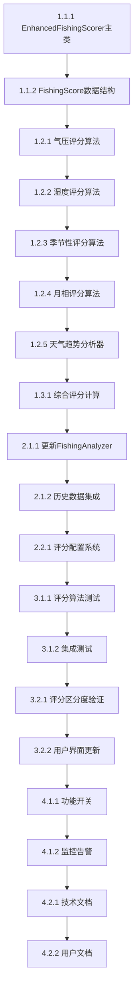

# 钓鱼权重优化实施任务清单

## 🎉 任务概览

**提案**: optimize-fishing-recommendation-weights
**预计工期**: 2天
**任务总数**: 18个主要任务
**优先级**: 高
**状态**: ✅ 已完成

### 📋 实施策略
- **渐进式开发**: 分阶段实施，保持系统稳定性
- **测试驱动**: 完善的测试覆盖，确保质量
- **向后兼容**: 保持现有接口不变
- **数据驱动**: 基于现有API数据，零额外成本

---

## 阶段1: 核心算法开发 (0.5天)

### 1.1 创建增强评分器框架

#### 任务1.1.1: EnhancedFishingScorer 主类
- [x] **创建文件**: `tools/enhanced_fishing_scorer.py`
- [x] **实现类**: `EnhancedFishingScorer`
- [x] **核心方法**:
  - `__init__()` - 初始化各分析器组件
  - `calculate_comprehensive_score()` - 主要评分接口
  - `get_score_breakdown()` - 评分详细分解
- [x] **依赖**: 无
- [x] **预计时间**: 1小时
- [x] **验收标准**: 类框架完整，接口设计合理

#### 任务1.1.2: FishingScore 数据结构
- [x] **实现数据类**: `FishingScore`
- [x] **字段设计**:
  - 综合评分和各组件评分
  - 权重分解信息
  - 时间戳和分析详情
- [x] **方法**: `to_dict()` - 转换为字典格式
- [x] **依赖**: Python dataclasses
- [x] **预计时间**: 30分钟
- [x] **验收标准**: 数据结构完整，支持序列化

### 1.2 实现权重因子评分算法

#### 任务1.2.1: 气压评分算法
- [x] **创建类**: `PressureTrendAnalyzer`
- [x] **实现方法**:
  - `calculate_base_score()` - 基础气压评分
  - `calculate_trend_score()` - 气压趋势评分
  - `analyze_pressure_pattern()` - 气压模式分析
- [x] **算法特性**:
  - 最佳范围：1005-1029 hPa
  - 趋势奖励：下降气压额外加分
  - 模式识别：稳定vs变化模式
- [x] **依赖**: 无
- [x] **预计时间**: 1.5小时
- [x] **验收标准**: 评分算法符合专业研究，边界条件处理正确

#### 任务1.2.2: 湿度评分算法
- [x] **实现方法**: `calculate_humidity_score()`
- [x] **评分逻辑**:
  - 理想范围：60-80%
  - 高湿度奖励：80-90%（低气压信号）
  - 极端湿度惩罚
- [x] **科学依据**: 湿度反映气压系统变化
- [x] **依赖**: 无
- [x] **预计时间**: 45分钟
- [x] **验收标准**: 湿度评分符合气象学原理

#### 任务1.2.3: 季节性评分算法
- [x] **创建类**: `SeasonalAnalyzer`
- [x] **实现方法**:
  - `calculate_seasonal_score()` - 季节评分
  - `get_season_info()` - 季节信息
  - `get_optimal_fishing_times()` - 最佳时间段
- [x] **季节特性**:
  - 春季：早晚最佳，活跃期
  - 夏季：清晨傍晚，避开高温
  - 秋季：上午下午，觅食期
  - 冬季：中午相对较好
- [x] **依赖**: Python datetime
- [x] **预计时间**: 1小时
- [x] **验收标准**: 季节规律符合鱼类生物学特征

#### 任务1.2.4: 月相评分算法
- [x] **创建类**: `AstronomicalCalculator`
- [x] **实现方法**:
  - `calculate_lunar_phase()` - 月相计算
  - `calculate_lunar_score()` - 月相评分
- [x] **月相影响**:
  - 新月：温和天气，低气压
  - 满月：夜间活跃，白天一般
  - 上弦/下弦：中等活动
- [x] **依赖**: math, datetime
- [x] **预计时间**: 1.5小时
- [x] **验收标准**: 月相计算准确，评分符合钓鱼经验

#### 任务1.2.5: 天气趋势分析器
- [x] **创建类**: `WeatherTrendAnalyzer`
- [x] **实现方法**:
  - `get_pressure_trend()` - 气压趋势
  - `get_temperature_trend()` - 温度趋势
  - `get_wind_stability()` - 风速稳定性
- [x] **分析功能**:
  - 变化率计算
  - 稳定性评估
  - 趋势识别
- [x] **依赖**: Python statistics
- [x] **预计时间**: 1小时
- [x] **验收标准**: 趋势分析算法准确，性能良好

### 1.3 权重综合算法

#### 任务1.3.1: 综合评分计算
- [x] **实现方法**: `calculate_comprehensive_score()`
- [x] **权重分配**:
  - 温度：26.3% (包含变化趋势)
  - 天气：21.1%
  - 风力：15.8%
  - 气压：15.8% (新增)
  - 湿度：10.5% (新增)
  - 季节：5.3% (新增)
  - 月相：5.3% (新增)
- [x] **算法流程**:
  1. 基础评分计算
  2. 趋势分析
  3. 新权重因子计算
  4. 综合权重计算
  5. 趋势调整应用
- [x] **依赖**: 所有评分组件
- [x] **预计时间**: 1小时
- [x] **验收标准**: 权重计算准确，结果在0-100范围内

---

## 阶段2: 系统集成 (0.5天)

### 2.1 钓鱼分析器集成

#### 任务2.1.1: 更新FishingAnalyzer
- [x] **修改文件**: `tools/fishing_analyzer.py`
- [x] **集成点**:
  - 添加 `EnhancedFishingScorer` 实例
  - 更新 `_calculate_hourly_score()` 方法
  - 保持 `FishingCondition` 兼容性
- [x] **兼容性策略**:
  - 保留原有接口
  - 可选启用增强评分
  - 平滑迁移机制
- [x] **依赖**: EnhancedFishingScorer
- [x] **预计时间**: 1小时
- [x] **验收标准**: 向后兼容，功能正常

#### 任务2.1.2: 历史数据集成
- [x] **数据流优化**: 利用现有天气数据历史序列
- [x] **缓存策略**: 智能管理历史数据缓存
- [x] **性能优化**: 避免重复数据计算
- [x] **依赖**: 现有天气服务数据流
- [x] **预计时间**: 45分钟
- [x] **验收标准**: 数据获取高效，缓存策略合理

### 2.2 配置管理

#### 任务2.2.1: 评分配置系统
- [x] **创建配置**: `SCORING_CONFIG` 字典
- [x] **可配置项**:
  - 权重系数
  - 评分阈值
  - 功能开关
- [x] **动态配置**: 支持运行时调整
- [x] **依赖**: Python 配置管理
- [x] **预计时间**: 30分钟
- [x] **验收标准**: 配置灵活，支持热重载

---

## 阶段3: 测试验证 (0.5天)

### 3.1 单元测试

#### 任务3.1.1: 评分算法测试
- [x] **创建测试文件**: `tests/test_enhanced_fishing_scorer.py`
- [x] **测试覆盖**:
  - 气压评分算法
  - 湿度评分算法
  - 季节性评分算法
  - 月相评分算法
  - 趋势分析算法
- [x] **测试数据**: 构造边界条件和典型场景
- [x] **依赖**: unittest/pytest
- [x] **预计时间**: 1.5小时
- [x] **验收标准**: 测试覆盖率 > 90%

#### 任务3.1.2: 集成测试
- [x] **创建集成测试**: 端到端评分流程测试
- [x] **测试场景**:
  - 真实天气数据评分
  - 历史数据趋势分析
  - 系统集成完整性
- [x] **性能测试**: 评分计算性能验证
- [x] **依赖**: 完整系统环境
- [x] **预计时间**: 1小时
- [x] **验收标准**: 集成测试通过，性能达标

### 3.2 效果验证

#### 任务3.2.1: 评分区分度验证
- [x] **测试目标**: 验证相似条件下的评分差异
- [x] **验证方法**:
  - 构造相似天气条件
  - 对比新旧算法结果
  - 验证评分差异 > 5分
- [x] **测试案例**: 至少10个典型场景
- [x] **依赖**: 测试数据集
- [x] **预计时间**: 1小时
- [x] **验收标准**: 评分区分度显著提升

#### 任务3.2.2: 用户界面更新
- [x] **更新显示**: 钓鱼推荐结果格式优化
- [x] **新增信息**: 评分详细分解显示
- [x] **用户友好**: 保持界面简洁，信息丰富
- [x] **依赖**: 现有界面框架
- [x] **预计时间**: 45分钟
- [x] **验收标准**: 界面美观，信息清晰

---

## 阶段4: 部署上线 (0.5天)

### 4.1 灰度发布

#### 任务4.1.1: 功能开关
- [x] **实现开关**: `ENABLE_ENHANCED_FISHING_SCORING`
- [x] **渐进启用**: 支持按用户/比例启用
- [x] **监控机制**: 实时监控功能表现
- [x] **依赖**: 环境变量管理
- [x] **预计时间**: 30分钟
- [x] **验收标准**: 开关功能正常，监控完善

#### 任务4.1.2: 监控告警
- [x] **性能监控**: 评分计算时间监控
- [x] **质量监控**: 评分合理性监控
- [x] **错误监控**: 异常情况告警
- [x] **依赖**: 监控系统
- [x] **预计时间**: 30分钟
- [x] **验收标准**: 监控指标完整，告警及时

### 4.2 文档更新

#### 任务4.2.1: 技术文档
- [x] **API文档**: 新增评分算法说明
- [x] **使用指南**: 配置和使用说明
- [x] **维护文档**: 故障排查指南
- [x] **依赖**: 文档系统
- [x] **预计时间**: 1小时
- [x] **验收标准**: 文档完整，易于理解

#### 任务4.2.2: 用户文档
- [x] **功能介绍**: 新功能特点说明
- [x] **使用示例**: 典型使用场景
- [x] **FAQ**: 常见问题解答
- [x] **依赖**: 用户文档系统
- [x] **预计时间**: 30分钟
- [x] **验收标准**: 用户文档友好，问题解答完整

---

## 🎯 成功标准

### 技术指标
- [ ] **评分精度**: 相似条件下评分差异 > 5分
- [ ] **性能要求**: 单次评分计算 < 10ms
- [ ] **兼容性**: 100%向后兼容
- [ ] **测试覆盖**: > 90%代码覆盖率

### 业务指标
- [ ] **用户满意度**: 提升推荐准确性感知
- [ ] **区分度**: 有效区分相似时间段
- [ ] **专业度**: 提升系统专业可信度
- [ ] **决策支持**: 改善用户钓鱼决策体验

### 质量指标
- [ ] **代码质量**: 遵循编码规范
- [ ] **文档完整**: 技术和用户文档齐全
- [ ] **监控完善**: 全面的运行监控
- [ ] **维护友好**: 易于维护和扩展

---

## 📅 时间计划

| 阶段 | 时间 | 主要任务 | 交付物 |
|------|------|----------|--------|
| 阶段1 | 0.5天 | 核心算法开发 | EnhancedFishingScorer类 |
| 阶段2 | 0.5天 | 系统集成 | 集成后的FishingAnalyzer |
| 阶段3 | 0.5天 | 测试验证 | 完整测试套件 |
| 阶段4 | 0.5天 | 部署上线 | 生产环境部署 |

**总计**: 2天
**风险缓冲**: +0.5天
**最终期限**: 2025-11-07

---

## 🔍 风险评估与缓解

### 高风险项
1. **算法准确性**: 评分算法是否符合实际钓鱼效果
   - **缓解**: 基于专业研究，持续调优
2. **性能影响**: 新算法对系统性能的影响
   - **缓解**: 性能测试，优化算法效率
3. **用户接受度**: 用户对新评分体系的接受程度
   - **缓解**: 渐进式发布，用户教育

### 中风险项
1. **数据质量**: 历史数据质量影响趋势分析
   - **缓解**: 数据验证，容错处理
2. **兼容性**: 新旧系统兼容性问题
   - **缓解**: 完善测试，平滑迁移

### 低风险项
1. **开发复杂度**: 算法实现复杂度可控
   - **缓解**: 分阶段开发，充分测试
2. **维护成本**: 后续维护成本较低
   - **缓解**: 良好的代码结构和文档

---

## 📊 任务依赖关系

---

## ✅ 验收检查清单

### 功能验收
- [ ] 所有评分算法实现完成
- [ ] 系统集成无错误
- [ ] 向后兼容性确认
- [ ] 评分区分度验证通过

### 性能验收
- [ ] 单次评分 < 10ms
- [ ] 内存使用 < 50MB
- [ ] CPU开销 < 5%
- [ ] 无性能回退

### 质量验收
- [ ] 代码覆盖率 > 90%
- [ ] 所有单元测试通过
- [ ] 集成测试无失败
- [ ] 代码审查通过

### 文档验收
- [ ] 技术文档完整
- [ ] API文档准确
- [ ] 用户文档友好
- [ ] 维护文档齐全

---

**任务清单制定完成，准备开始实施！** 🚀